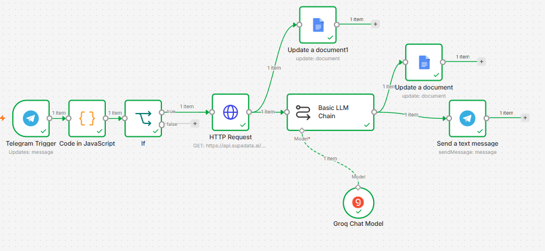
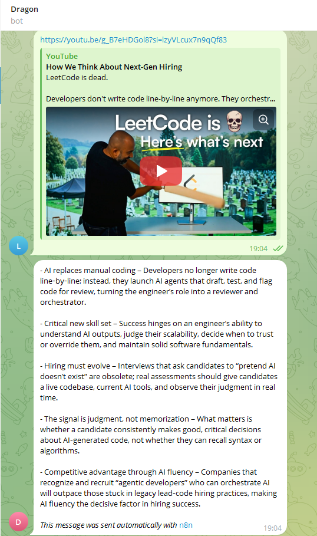

# 🐉 Dragon — AI-Powered Telegram Bot

> A fully deployed conversational AI bot built with zero backend code. Just workflows, inference, and a live endpoint.

👉 **Try it live:** [t.me/Loki839Bot](https://t.me/Loki839Bot)

---

## 🧠 What is Dragon?

Dragon is a deployed Telegram bot that uses a large language model to understand and respond to user messages in real time. It is not a rule-based bot with hardcoded replies. It actually thinks, processing your input through an LLM and returning a contextual, intelligent response.

The goal was simple: move from building automation to deploying automation. There is a big difference between something that works on localhost and something that is live, handling real users, real inputs, and real edge cases. Dragon is the latter.

---

### Workflow Diagram



---

## 💡 Motivation

Automation has always been a core interest, from studying multi-sensor autonomous UGVs at AVNL/HVF Avadi, to building UAV-UGV collaborative navigation systems at IIT Madras. But most of that work lives in research pipelines, simulation environments, and lab setups.

This project was about getting first-hand experience with a live deployed automation, one that real users can interact with right now, without any manual intervention. No scripts to run. No server to babysit. Just a workflow that wakes up when someone sends a message and goes back to sleep when it is done.

---

## 🔧 Tech Stack

- **n8n** — open-source workflow automation engine that orchestrates the entire pipeline. Triggers on incoming Telegram messages, routes them to the LLM, and sends the response back.
- **Groq** — blazing fast LLM inference API with a free tier. Handles the actual language understanding and response generation.
- **Telegram Bot API** — the user-facing interface. Handles message delivery, webhook setup, and bot identity.
- **Supadata** - extracts the spoken transcript/subtitles from a YouTube video.
---

## 🔁 How It Works

````
User sends message on Telegram
        ↓
Telegram Bot API receives message via webhook
        ↓
n8n workflow is triggered
        ↓
Message is passed to Groq LLM as prompt
        ↓
LLM generates a response
        ↓
n8n sends response back through Telegram Bot API
        ↓
User receives reply
````


---

## 💬 Demo

A real conversation with Dragon:



---

## 🚀 Features

- **Zero backend code** — entire logic built visually in n8n
- **Real LLM responses** — not hardcoded, not keyword-matched
- **Always live** — no manual trigger needed, webhook-based
- **Fast inference** — Groq delivers sub-second LLM responses
- **Free to run** — built entirely on free tiers


---

## 📣 LinkedIn Post

Read the full story behind the build:
[🔗 View LinkedIn Post](https://www.linkedin.com/posts/lokesh-dandumahanti-78b157257_automation-telegrambot-buildinpublic-ugcPost-7464681485271474176-KG16/)

---

## 👤 Author

**Lokesh Dandumahanti**
Research Associate, IIT Madras (ANRF-PAIR Fellowship) | B.Tech Mechanical Engineering, NIT Puducherry
Working on computer vision, autonomous systems, and UAV-UGV navigation.

Always building. Always automating. 🔥
